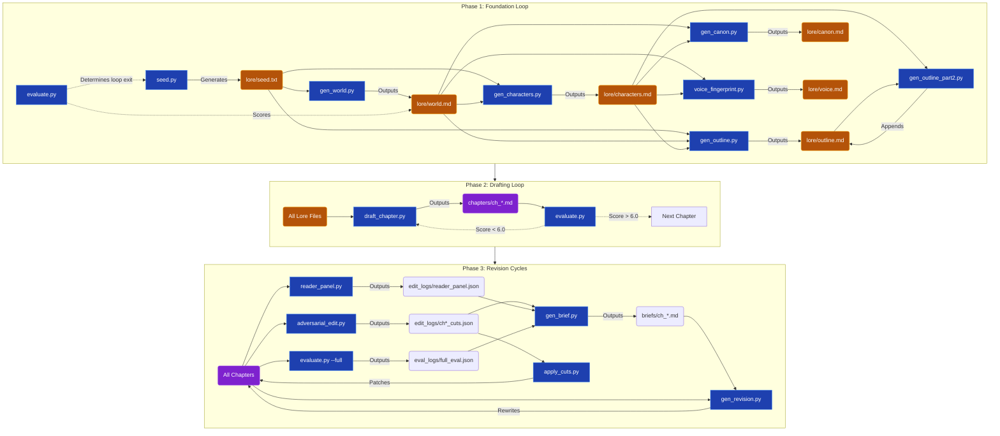

# autonovel

An autonomous pipeline for writing, revising, typesetting, illustrating,
and narrating a complete novel. From a seed concept to a print-ready PDF,
ePub, audiobook, and landing page — all generated by AI agents.

Inspired by [karpathy/autoresearch](https://github.com/karpathy/autoresearch):
the same modify-evaluate-keep/discard loop, applied to fiction.

**First novel produced:** *The Second Son of the House of Bells* —
19 chapters, 79,456 words.
See the `autonovel/bells` branch.

---

## Quick Start

```bash
# Clone and setup
git clone <repo-url> && cd autonovel
cp .env.example .env    # Add your API keys

# Install dependencies
uv sync

# Generate a seed concept (or write your own in seed.txt)
uv run python scripts/seed.py

# Run the full pipeline
uv run python scripts/run_pipeline.py --from-scratch
```

---

## The Pipeline

### Phase 1: Foundation
Build the world, characters, outline, voice, and canon from a seed concept.
Loop until `foundation_score > 7.5`.

### Phase 2: First Draft
Write chapters sequentially. Evaluate each one. Keep if `score > 6.0`,
retry if not. Forward progress over perfection.

### Phase 3a: Automated Revision
Adversarial editing → apply cuts → reader panel → generate briefs →
rewrite chapters. Plateau detection stops the loop when scores stabilize.

### Phase 3b: Opus Review Loop
Send the full manuscript to Claude Opus for dual-persona review
(literary critic + professor of fiction). Parse actionable items.
Fix the top issues. Repeat until the reviewer runs out of major items.

### Phase 4: Export
Rebuild docs, typeset in LaTeX, generate art, produce audiobook scripts,
build ePub, create landing page.

See [PIPELINE.md](PIPELINE.md) for the full technical specification.

---

## Tools (27 Python scripts)

### Foundation
| Tool | Purpose |
|------|---------|
| `seed.py` | Generate seed concepts |
| `gen_world.py` | Seed → world bible |
| `gen_characters.py` | Seed + world → character registry |
| `gen_outline.py` | Outline with beats and foreshadowing |
| `gen_outline_part2.py` | Foreshadowing ledger |
| `gen_canon.py` | Cross-reference hard facts |
| `voice_fingerprint.py` | Voice analysis and discovery |

### Drafting
| Tool | Purpose |
|------|---------|
| `draft_chapter.py` | Write a single chapter with anti-pattern rules |
| `run_drafts.py` | Batch sequential chapter drafter |

### Evaluation
| Tool | Purpose |
|------|---------|
| `evaluate.py` | Mechanical slop scorer + LLM judge |
| `adversarial_edit.py` | "Cut 500 words" analysis → classified cuts |
| `compare_chapters.py` | Head-to-head Elo tournament |
| `reader_panel.py` | 4-persona novel-level evaluation |
| `review.py` | Opus dual-persona review with stopping conditions |

### Revision
| Tool | Purpose |
|------|---------|
| `gen_brief.py` | Auto-generate revision briefs from feedback |
| `gen_revision.py` | Rewrite a chapter from a revision brief |
| `apply_cuts.py` | Batch adversarial cut applicator |

### Art & Cover
| Tool | Purpose |
|------|---------|
| `gen_art.py` | Art pipeline: style, curate, ornaments, vectorize |
| `gen_art_directions.py` | Generate diverse art directions for curation |
| `gen_cover_composite.py` | Text overlay on cover art |
| `gen_cover_print.py` | Print-ready full-wrap cover (Lulu/KDP specs) |

### Audiobook
| Tool | Purpose |
|------|---------|
| `gen_audiobook_script.py` | Parse chapters into speaker-attributed scripts |
| `gen_audiobook.py` | Generate multi-voice audio via ElevenLabs |

### Orchestration
| Tool | Purpose |
|------|---------|
| `run_pipeline.py` | Full pipeline orchestrator (seed → finished novel) |
| `build_arc_summary.py` | Regenerate arc summary from chapters |
| `build_outline.py` | Regenerate outline from chapters |

---

## File Structure

```
FRAMEWORK (reusable, on master):
  framework/program.md             — Agent instructions per phase
  framework/CRAFT.md               — Craft education (plot, character, world, prose)
  framework/ANTI-SLOP.md           — Word-level AI tell detection
  framework/ANTI-PATTERNS.md       — Structural AI pattern detection
  framework/PIPELINE.md            — Full automation specification
  framework/WORKFLOW.md            — Step-by-step human guide
  framework/AGENTS.md              — Agent orientation and rules

TEMPLATES (filled per-novel on a branch):
  lore/voice.md               — Part 1: guardrails. Part 2: discovered per novel
  lore/world.md               — World bible template
  lore/characters.md          — Character registry template
  lore/outline.md             — Chapter outline template
  lore/canon.md               — Hard facts database
  lore/MYSTERY.md             — Central mystery (author-only)
  state.json                  — Pipeline state tracker

TYPESETTING:
  typeset/novel.tex      — LaTeX template (EB Garamond, trade paperback)
  typeset/build_tex.py   — Chapters → LaTeX with vector ornaments
  typeset/epub_*          — ePub metadata, CSS, and front matter

ART:
  audiobook_voices.json  — Character → ElevenLabs voice mapping
  landing/index.html     — Responsive landing page template

CONFIG:
  .env.example           — API keys (Anthropic, fal.ai, ElevenLabs)
  pyproject.toml         — Python dependencies
```

---

## How It Works

The novel is five co-evolving layers:

```
  Layer 5:  lore/voice.md          — HOW we write
  Layer 4:  lore/world.md          — WHAT exists
  Layer 3:  lore/characters.md     — WHO acts
  Layer 2:  lore/outline.md        — WHAT HAPPENS
  Layer 1:  chapters/ch_NN.md      — THE ACTUAL PROSE
  Cross-cutting: lore/canon.md     — WHAT IS TRUE
```

Changes propagate both down (lore change → outline change → chapter
revision) and up (writing reveals a gap → update lore → check
downstream). The pipeline tracks propagation debts in `state.json`.

### Two Immune Systems

1. **Mechanical** (`evaluate.py`, no LLM): regex scans for banned words,
   fiction clichés, show-don't-tell violations, sentence uniformity.

2. **LLM Judge** (`evaluate.py`, separate model): scores prose quality,
   voice adherence, character distinctiveness, beat coverage.

### The Opus Review Loop

After automated revision cycles, the full manuscript goes to Claude Opus
with this prompt:

> "Read the below novel. Review it first as a literary critic and then
> as a professor of fiction. Give specific, actionable suggestions for
> any defects you find. Be fair but honest. You don't have to find defects."

The dual-persona review catches what automated tools can't: prose-level
repetition, character thinness, ethical gaps, structural monotony. The
loop continues until the reviewer's items are mostly qualified hedges rather than real problems.

---

## API Keys

The pipeline uses three external services:

| Service | Key | Used for |
|---------|-----|----------|
| Anthropic | `ANTHROPIC_API_KEY` | Writing, evaluation, review (Sonnet + Opus) |
| fal.ai | `FAL_KEY` | Cover art and ornament generation (Nano Banana 2) |
| ElevenLabs | `ELEVENLABS_API_KEY` | Multi-voice audiobook generation |

Copy `.env.example` to `.env` and fill in your keys. Only the Anthropic
key is required for the core pipeline. Art and audiobook are optional.

---

## Production History

The first novel, *The Second Son of the House of Bells*, was produced
through this pipeline:

- **Foundation:** World bible, 8 characters, 24-chapter outline, voice discovery
- **Drafting:** 24 chapters, 75,698 words, sequential with evaluation
- **Revision:** 6 automated cycles + 6 Opus review rounds
- **Structural:** 24 → 19 chapters through 4 merges
- **Art:** Linocut cover (Nano Banana 2), 19 woodcut chapter ornaments (vectorized)
- **Audiobook:** 19 chapters parsed into 4,179 speaker-attributed segments
- **Final:** 79,456 words, 6 review rounds, all major items resolved

---

## Inspiration

- [karpathy/autoresearch](https://github.com/karpathy/autoresearch) — the autonomous research loop
- Brandon Sanderson's writing lectures (Laws of Magic, character sliders)
- K.M. Weiland's *Creating Character Arcs*
- Blake Snyder's *Save the Cat*
- Ursula K. Le Guin's "From Elfland to Poughkeepsie"
- [slop-forensics](https://github.com/sam-paech/slop-forensics) and [EQ-Bench Slop Score](https://eqbench.com/slop-score.html)
---
file: CHANGELOG.md
description: Log of notable changes and refactoring efforts across the autonovel pipeline.
version: 1.0.0
created: 2026-05-31
modified: 2026-05-31
author: Antigravity
---

# Changelog

All notable changes to this project will be documented in this file.

## [Unreleased] - 2026-05-31

### Added
- **`AGENTS.md`**: Added an orientation guide for AI agents operating in the workspace, ensuring output predictability and establishing global guidelines.
- **Gitignore Expansion**: Added comprehensive ignore rules for macOS, Linux, and Windows system files, as well as AI-specific `.gemini/` and `workspace_antigravity/` directories to prevent accidental commits.
- **Workspace Reports**: Generated structural security and SAST scan reports inside `workspace_antigravity/` to track codebase health and AI pipeline safety.

### Changed
- **Script Reorganization**: Moved all 27 Python scripts out of the root directory into a dedicated `scripts/` module. This massively cleans up the project root and isolates pipeline execution logic.
- **Data Reorganization**: Moved framework guidelines into a `framework/` directory and novel-specific context/lore files into a `lore/` directory.
- **Configuration Refactoring**: Extracted all hardcoded system prompts, user prompts, and model hyperparameters (like `temperature` and `max_tokens`) out of the python scripts. These are now defined in cleanly separated `.toml` files located within the new `config/` directory. Python scripts use the `tomllib` standard library to dynamically load these values.
- **Orchestration Execution Paths**: Updated `run_pipeline.py` and `run_drafts.py` to transparently route `uv run` commands into the new `scripts/` directory.
- **Relative Path Resolution**: Updated `BASE_DIR` logic in all scripts from `Path(__file__).parent` to `Path(__file__).parent.parent` so they correctly find artifacts in the root directory.
- **Documentation**: Updated the Quick Start examples in `README.md` to reflect the new `scripts/`, `lore/`, `framework/`, and `config/` folder routing.

### Security
- **SAST Remediation (Shell Injection Risk)**: Refactored `subprocess.run` executions across `run_pipeline.py` and `run_drafts.py`. Removed `shell=True` usages, implemented `shlex.split` for safe command tokenization, and replaced insecure shell pipeline logic (like `grep` and `wc -w`) with robust, native Python file I/O.
# Autonovel Script Architecture & Data Flow

This document provides a detailed mapping of the autonovel pipeline's scripts, their configurations, their input dependencies, and their output artifacts. It also explains the execution loops that orchestrate them.

---

## 1. Directory Context

- **`scripts/`**: Contains the Python logic and LLM API calls.
- **`config/`**: Contains `.toml` configuration files (prompts, temperature, max_tokens).
- **`lore/`**: The state of the novel (world, characters, outline, voice).
- **`chapters/`**: The raw `.md` prose files.
- **`edit_logs/` & `eval_logs/` & `briefs/`**: Transient data files for the revision cycles.

---

## 2. End-to-End Workflow Diagram



---

## 3. Phase 1: Foundation (Iterative Loop)

**Execution Logic:** Managed by `run_pipeline.py`. It runs the entire sequence below, then calls `evaluate.py`. If the score improves over the previous iteration, it commits the changes. If not, it does a hard reset. This loop repeats until the foundation scores `> 7.5`, ensuring a robust world before drafting begins.

| Script | Configuration File (`config/`) | Inputs | Outputs |
| :--- | :--- | :--- | :--- |
| **`seed.py`** | `seed.toml` | *None* | `seed.txt` |
| **`gen_world.py`** | `gen_world.toml` | `seed.txt` | `lore/world.md` |
| **`gen_characters.py`** | `gen_characters.toml` | `seed.txt`, `lore/world.md` | `lore/characters.md` |
| **`gen_outline.py`** | `gen_outline.toml` | `seed.txt`, `world.md`, `characters.md` | `lore/outline.md` (Beats) |
| **`gen_outline_part2.py`** | `gen_outline_part2.toml` | `outline.md`, `characters.md` | `lore/outline.md` (Foreshadowing) |
| **`gen_canon.py`** | `gen_canon.toml` | `world.md`, `characters.md` | `lore/canon.md` (Hard facts) |
| **`voice_fingerprint.py`** | *Internal prompts (currently)* | `world.md`, `characters.md` | `lore/voice.md` (Prose identity) |

---

## 4. Phase 2: Drafting (Sequential Retry Loop)

**Execution Logic:** Managed by `run_pipeline.py`. It takes the generated outline and drafts chapters sequentially (1 to N). For each chapter, it drafts the prose and immediately calls `evaluate.py`. If the score is `< 6.0`, it discards the text and retries (up to 5 times). Once passing, it commits and moves to the next chapter.

| Script | Configuration File (`config/`) | Inputs | Outputs |
| :--- | :--- | :--- | :--- |
| **`draft_chapter.py`** | `draft_chapter.toml` | All `lore/` files, Previous Chapter | `chapters/ch_[01-N].md` |
| **`evaluate.py`** | `evaluate.toml` | Single chapter prose | Console Score / Exit Code |

---

## 5. Phase 3: Revision (Multi-Cycle Loop)

**Execution Logic:** Managed by `run_pipeline.py`. The pipeline executes 3 to 6 full revision cycles. Each cycle consists of three steps:
1. **Diagnosis:** Run analytical scripts (`adversarial_edit`, `reader_panel`, `evaluate`) to generate JSON feedback.
2. **Briefing:** `gen_brief.py` dynamically synthesizes the JSON feedback into actionable Markdown briefs (`briefs/*.md`).
3. **Execution:** `gen_revision.py` and `apply_cuts.py` execute the changes on the raw prose.
The loop stops if evaluation scores plateau for two consecutive cycles.

| Script | Configuration File (`config/`) | Inputs | Outputs |
| :--- | :--- | :--- | :--- |
| **`build_arc_summary.py`**| `build_arc_summary.toml` | All `chapters/*.md` | `arc_summary.md` |
| **`adversarial_edit.py`** | `adversarial_edit.toml` | All `chapters/*.md` | `edit_logs/ch*_cuts.json` |
| **`reader_panel.py`** | `reader_panel.toml` | `arc_summary.md`, `chapters/*.md` | `edit_logs/reader_panel.json` |
| **`evaluate.py --full`**| `evaluate.toml` | All `chapters/*.md` | `eval_logs/full_eval.json` |
| **`gen_brief.py`** | *No LLM calls (deterministic)*| Cut JSONs, Panel JSONs, Eval JSONs | `briefs/ch_*.md` (Instructions) |
| **`gen_revision.py`** | `gen_revision.toml` | `briefs/ch_*.md`, `chapters/ch_*.md` | Updated `chapters/ch_*.md` |
| **`apply_cuts.py`** | *No LLM calls (deterministic)*| `edit_logs/ch*_cuts.json` | Updated `chapters/ch_*.md` |
| **`build_outline.py`** | `build_outline.toml` | All `chapters/*.md` | Updated `lore/outline.md` |
| **`compare_chapters.py`** | `compare_chapters.toml` | All `chapters/*.md` | `edit_logs/tournament_results.json` |
| **`review.py`** | `review.toml` | All `chapters/*.md` (Final Polish) | `reviews.md` |

---

## 6. Optional / Parallel Modules

These tools operate independently from the main pipeline loop.

| Script | Configuration File (`config/`) | Inputs | Outputs |
| :--- | :--- | :--- | :--- |
| **`gen_art.py`** | `gen_art.toml` | `outline.md`, `world.md`, `voice.md` | `art/visual_style.json` |
| **`gen_art_directions.py`**| `gen_art_directions.toml`| `visual_style.json`, `world.md` | Console / Art Prompts |
# AUTONOVEL: Reproducible Novel Pipeline

## Overview

This document captures the full automated pipeline for generating,
drafting, and revising a novel from a seed concept. Derived from the
production of "The Second Son of the House of Bells" (75k words, 23
chapters, 5 revision cycles).

The goal: a user provides a seed concept. Everything else is automated.

---

## Master Branch (Framework)

Master contains no story-specific content. It is the reusable base.

```
FRAMEWORK (reusable, never edited by the pipeline):
  README.md            -- project overview
  WORKFLOW.md          -- step-by-step human guide
  PIPELINE.md          -- this file (automation spec)
  program.md           -- agent instructions per phase
  CRAFT.md             -- craft education (plot, character, world, prose)
  ANTI-SLOP.md         -- word-level AI tell detection
  ANTI-PATTERNS.md     -- structural AI pattern detection

TEMPLATES (empty shells, filled per-novel on branch):
  voice.md             -- Part 1 (guardrails) permanent; Part 2 blank
  world.md             -- section headers only
  characters.md        -- structure template only
  outline.md           -- structure template only
  canon.md             -- empty with instructions
  MYSTERY.md           -- blank template
  state.json           -- {phase: "foundation", iteration: 0, debts: []}

TOOLS (the pipeline machinery):
  Foundation:
    seed.py              -- generate 10 seed concepts
    gen_world.py         -- seed → world.md
    gen_characters.py    -- seed + world → characters.md
    gen_outline.py       -- seed + world + chars → outline.md (part 1)
    gen_outline_part2.py -- outline + chars → foreshadowing ledger
    gen_canon.py         -- world + chars → canon.md (hard facts)
    voice_fingerprint.py -- trial passages → voice.md Part 2

  Drafting:
    draft_chapter.py     -- write a single chapter with anti-pattern rules
    run_drafts.py        -- batch sequential chapter drafter

  Evaluation:
    evaluate.py          -- mechanical slop scorer + LLM judge
                            modes: --phase=foundation, --chapter=N, --full

  Revision:
    adversarial_edit.py  -- "cut 500 words" judge → classified cut list
    compare_chapters.py  -- head-to-head Elo tournament
    reader_panel.py      -- 4-persona novel-level evaluation
    gen_revision.py      -- rewrite chapter from a revision brief
    build_arc_summary.py -- regenerate arc_summary.md from chapters
    build_outline.py     -- regenerate outline.md from chapters

  Export:
    typeset/novel.tex    -- LaTeX template (EB Garamond, trade paperback)
    typeset/build_tex.py -- chapters/*.md → chapters_content.tex

  Orchestrator:
    run_pipeline.py      -- NEW: fully automated pipeline runner

CONFIG:
  .env.example           -- API key template
  pyproject.toml         -- Python dependencies (httpx, dotenv)
  .python-version
  .gitignore
```

---

## Per-Novel Branch (Generated)

Everything below is created automatically on a branch.

```
  seed.txt               -- chosen seed concept
  world.md               -- filled world bible
  characters.md          -- filled character registry
  outline.md             -- filled chapter outline + foreshadowing ledger
  voice.md Part 2        -- discovered voice identity
  canon.md               -- accumulated hard facts
  MYSTERY.md             -- central mystery (author-only)
  chapters/ch_*.md       -- the prose
  state.json             -- current phase, scores, debts
  results.tsv            -- experiment log (every keep/discard)
  arc_summary.md         -- chapter summaries for panel evaluation
  edit_logs/*.json       -- adversarial cuts, panel results, tournament
  eval_logs/*.json       -- full evaluation results
  briefs/*.md            -- revision briefs (input to gen_revision.py)
  typeset/novel.pdf      -- typeset PDF
```

---

## THE PIPELINE

### Phase 0: Setup

```
INPUT:  seed.txt (user-provided or generated via seed.py)
OUTPUT: branch created, .env configured

1. git checkout -b autonovel/<tag>
2. Verify .env has ANTHROPIC_API_KEY
3. Verify seed.txt exists and is specific enough
   (world-differentiator, central tension, cost/constraint, sensory hook)
```

### Phase 1: Foundation

```
INPUT:  seed.txt
OUTPUT: world.md, characters.md, outline.md, voice.md, canon.md, MYSTERY.md
EXIT:   foundation_score > 7.5 AND lore_score > 7.0

Loop:
  1. gen_world.py        → world.md (lore, magic system, geography, factions)
  2. gen_characters.py   → characters.md (wound/want/need/lie, speech, sliders)
  3. gen_outline.py      → outline.md part 1 (beats, chapter structure)
  4. gen_outline_part2.py → outline.md part 2 (foreshadowing ledger)
  5. Voice discovery: write 5 trial passages in different registers,
     select best, fill voice.md Part 2 with exemplars + anti-exemplars
  6. Define MYSTERY.md (the central secret the reader discovers)
  7. gen_canon.py        → canon.md (cross-reference all hard facts)
  8. evaluate.py --phase=foundation
  9. If score improved → git commit. If worse → git reset --hard HEAD~1.
  10. Identify weakest dimension → target next iteration at it.

Key learnings:
  - Foundation typically takes 5-15 iterations
  - The evaluator weights lore interconnection at 40% — magic must
    affect politics, history must explain factions, geography must
    shape culture
  - Cross-layer consistency check on EVERY iteration
  - Canon should have 400+ entries before exiting foundation
  - Voice discovery is a separate sub-loop: write trial passages,
    evaluate, select, refine
```

### Phase 2: First Draft

```
INPUT:  all foundation docs
OUTPUT: chapters/ch_01.md through ch_NN.md
EXIT:   all chapters drafted with score > 6.0

For each chapter in outline order:
  1. Load context window:
     - voice.md (full)
     - world.md (full)
     - characters.md (full)
     - This chapter's outline entry
     - Previous chapter's last ~1000 words
     - Next chapter's outline (for continuity)
  2. draft_chapter.py → chapters/ch_NN.md
  3. evaluate.py --chapter=NN
  4. If score > 6.0 → keep, commit. If < 6.0 → discard, retry (max 5).
  5. Extract new canon entries from eval output → append to canon.md
  6. Log to results.tsv

Post-draft cleanup:
  7. Mechanical slop pass (evaluate.py regex scanner) across all chapters
  8. Fix recurring AI patterns identified in early chapters
     (these compound — fix them before revision phase)
  9. Update state.json phase to "revision"

Key learnings:
  - Forward progress over perfection. 6.0 is good enough.
  - Chapters 1-6 score higher than 7-24 (freshness decay).
    After ch 6, add anti-pattern rules to the writer prompt.
  - Batch the second half (ch 11+) — it's faster and the quality
    is consistent enough.
  - The mechanical slop pass catches ~200 instances of tier-1 banned
    words, em-dash overuse, and sentence-length uniformity.
  - Total drafting time: ~8-16 hours of API calls for 25 chapters.
```

### Phase 3: Revision

This is where the real quality happens. 3-6 cycles, each with a
specific focus. Stop when scores plateau across 2 consecutive cycles.

```
CYCLE 1: BASELINE & DIAGNOSIS

  1. adversarial_edit.py all
     → edit_logs/chNN_cuts.json for all chapters
     → Systemic pattern identified (expect OVER-EXPLAIN at ~30-35%)
  2. compare_chapters.py
     → edit_logs/tournament_results.json (Elo rankings)
  3. Apply top cuts:
     Focus on OVER-EXPLAIN + REDUNDANT (together ~55-60% of all cuts)
     Target: chapters with >17% fat
     Method: automated quote-matching removal
     Expect to cut ~2000-3000 words (~3-4% of novel)
  4. reader_panel.py
     → edit_logs/reader_panel.json
     4 personas: editor, genre reader, writer, first reader
     Each answers: momentum_loss, earned_ending, cut_candidate,
       missing_scene, thinnest_character, best_scene, worst_scene,
       would_recommend, haunts_you, next_book
  5. Identify CONSENSUS items (3/4 or 4/4 agreement):
     These are the revision priorities.
  6. Git commit: "Cycle 1: adversarial + panel baseline"
```

```
CYCLE 2-3: STRUCTURAL REVISIONS (address panel consensus)

  For each consensus item, in priority order:
    a. CUT CANDIDATE (4/4 agreement):
       Write compression brief → gen_revision.py
       Target: cut 40-60% of chapter words
       Keep: the 2-3 essential beats the panel identified
       WARNING: don't over-compress. 1700w is too thin for any chapter.
       Sweet spot: 2200-3000w for a compressed chapter.

    b. MISSING SCENE (4/4 agreement):
       Write expansion brief → gen_revision.py for the target chapter
       OR: surgical patch if the scene is <400 words
       Key: the brief must specify what to KEEP (existing good material)
       and what to ADD (the missing beat)

    c. THIN CHARACTER (4/4 agreement):
       Identify 1-2 existing scenes where the character appears
       Add a private/unguarded moment the POV character catches
       Connect to the character's backstory in characters.md
       DON'T add a new scene — deepen an existing one

    d. WEAK SCENE (3/4 agreement):
       Write dramatization brief → gen_revision.py
       Change HOW information arrives, not WHAT information
       Convert "reading a document" → investigation/confrontation
       Convert "briefing" → confrontation with resistance

    e. CONSISTENCY / TIMELINE:
       Search for contradictions (years, ages, sequence of events)
       Fix in canon.md + all source files + chapter references
       The 10yr/12yr distinction will happen. Plan for it.

    f. CHAPTER RENUMBERING:
       If chapters were merged/deleted, ALL internal titles need updating
       Use a script, not manual edits

  After each structural change:
    evaluate.py --chapter=N for affected chapters
    Keep if improved, discard if not
    Git commit with detailed message

  evaluate.py --full → get novel-level scores
  Git commit: "Cycle N: structural revisions from panel"
```

```
CYCLE 4-5: TARGETED IMPROVEMENTS (address eval callouts)

  evaluate.py --full produces:
    - weakest_dimension (usually pacing_curve)
    - weakest_chapter
    - top_suggestion (specific fix)
    - per-dimension scores and commentary

  Common patterns and fixes:
    a. PACING (always the stubborn score):
       - Act II investigation rhythm repetitive →
         compress the weakest investigation chapter, vary scene types
       - Act III compressed → expand ally-gathering and climax
       - Reveals fire too fast → add breathing beats between reveals
       WARNING: fixing one stretch exposes the next. Pacing=7 may be
       a structural ceiling for LLM-evaluated novels.

    b. CHAPTER TOO SHORT for structural importance:
       Write expansion brief → gen_revision.py
       Target: +800-1500 words
       Focus: physical accumulation, dread, silence-with-duration
       The brief should specify WHAT BEATS to expand, not just "make longer"

    c. REPEATED PHRASES across chapters:
       Search for the phrase across all chapters
       Change all but the most impactful instance
       Common AI repeats: opening descriptions, emotional formulas,
       "the way [X] did [Y]", triadic lists

    d. UNRESOLVED THREADS:
       Check foreshadowing ledger in outline.md
       Add resolution beats where threads were planted but never harvested
       Surgical patches, not full rewrites

  After fixes:
    evaluate.py --full → check scores improved
    If weakest_chapter changed → previous fix worked
    If scores unchanged after 2 cycles → stop, diminishing returns
```

```
CYCLE 6: POLISH (final pass)

  1. adversarial_edit.py all → fresh cut data on rewritten chapters
  2. Apply cuts from chapters that were rewritten in cycles 2-5
  3. Slop pass: evaluate.py per-chapter on rewritten chapters
  4. reader_panel.py → final validation
  5. Rebuild founding docs
```

```
PHASE 3b: OPUS REVIEW LOOP (deep, prose-level refinement)

  After the automated cycles, switch to Opus for the final quality push.
  This is the evaluation that actually catches prose problems, structural
  repetition, character thinness, and ethical gaps.

  Tool: review.py
  Model: Claude Opus (the best available for literary analysis)
  Prompt: "Read the below novel. Review it first as a literary critic
    (like a newspaper book review) and then as a professor of fiction.
    In the later review, give specific, actionable suggestions for any
    defects you find. Be fair but honest. You don't *have* to find defects."

  Loop (max 4 rounds):
    1. review.py --output reviews.md
       Sends full manuscript to Opus. Gets dual-persona review.
    2. review.py --parse
       Extracts actionable items, severity, type.
       Classifies items: major/moderate/minor, qualified/unqualified.
    3. STOPPING CONDITION:
       Stop if: no major unqualified items remain
       Stop if: >50% of items are qualified/hedged
       Stop if: ≤2 items found
       These signals mean the reviewer is running out of real problems.
    4. Address top items:
       - gen_brief.py --auto → picks weakest chapter, generates brief
       - gen_revision.py → rewrites chapter from brief
       - Mechanical fixes (apply_cuts.py) for pattern issues
       - Surgical patches for targeted additions
    5. Commit, repeat.

  Key learnings from the Bells production (6 review rounds):
    - The same issues surface repeatedly until fixed (middle pacing,
      tics, character depth). This is the signal to act.
    - When the language shifts from "the novel has problems" to
      "these are the costs of ambition" → stop revising.
    - The reviewer will ALWAYS find something. The stopping condition
      is about severity and qualification, not zero defects.
    - Items that persist across 3+ rounds may be structural to the
      novel's voice/approach, not bugs. Learn to accept them.
    - The reviewer's item severity is the guide:
      multiple major items → structural work needed
      few major, some moderate → targeted revisions, 2-3 more rounds
      all moderate/minor → polish only, 1-2 more rounds
      mostly qualified hedges → done, ship it
```

### Phase 4: Export

```
  1. Normalize chapter titles (all # level, consistent format)
  2. typeset/build_tex.py → chapters_content.tex
  3. Edit typeset/novel.tex:
     - Set title, author name
     - Choose epigraph (from novel text, NOT a spoiler)
     - Set end-page text
  4. tectonic novel.tex → novel.pdf
  5. Git commit: "Export: [title] — [word count] words"
```

---

## KEY LEARNINGS (from the Bells production)

### What the evaluator rewards
  - Theme coherence hits ceiling (10) early if the seed has a strong
    central question. Build the magic system AS the theme.
  - Voice consistency (9) holds if you never break POV and keep the
    craft vocabulary native.
  - Foreshadowing (9) requires a ledger maintained from foundation
    through drafting. Every plant needs a payoff.

### What the evaluator penalizes
  - Pacing (7) is structurally stubborn. Investigation chapters
    (go-learn-blocked) repeat a rhythm that the evaluator catches.
    Fix one stretch, it finds the next. Accept 7 as the likely ceiling
    unless you restructure the plot.
  - OVER-EXPLAIN is the #1 AI writing pattern (~32% of adversarial cuts).
    The narrator explains what scenes already showed. Cut aggressively.
  - REDUNDANT is #2 (~26%). Same insight restated 3-4 times. Once is enough.

### What the reader panel catches that the evaluator doesn't
  - "Checklist of yeses" — when allies all agree without friction
  - Missing emotional scenes between key characters
  - Characters who are "more mechanism than person"
  - Scenes that need to be messier, more human, less choreographed
  - The difference between a scene that "works" and one that "lives"

### Dangerous patterns
  - Over-compressing: cutting a chapter below 1800w makes it the new
    weakest. Sweet spot is 2200-3000w for compressed chapters.
  - Expansion bloat: gen_revision.py adds ~30% more words than briefed.
    A brief targeting 3200w will produce 3800-4200w.
  - Score chasing: after cycle 4, fixing one score often drops another.
    Arc went 9→8→9 when we over-compressed Ch 11.
  - The evaluator rotates "weakest chapter" — chasing it is whack-a-mole.
    After 2 rotations, stop.

### Timeline estimates
  Phase 1 (Foundation):    2-4 hours API time, 5-15 iterations
  Phase 2 (First Draft):   8-16 hours API time, 23-30 chapters
  Phase 3 (Revision):      4-8 hours API time, 3-6 cycles
  Phase 4 (Export):         30 minutes
  TOTAL:                    ~15-30 hours API time for a 75k word novel

---

## WHAT NEEDS BUILDING FOR FULL AUTOMATION

### Already exists (on branch, needs merge to master):
  - gen_revision.py
  - reader_panel.py
  - build_arc_summary.py
  - build_outline.py
  - voice_fingerprint.py
  - typeset/novel.tex + build_tex.py

### Needs building:
  1. run_pipeline.py — Orchestrator that runs all phases
     - Phase 1: loop foundation generation + evaluation
     - Phase 2: sequential drafting with retry logic
     - Phase 3: revision cycles with automated brief generation
     - Phase 4: export
     - Score plateau detection (stop when Δ < 0.5 across 2 cycles)
     - Automated brief writing from panel feedback + eval callouts

  2. gen_brief.py — Auto-generate revision briefs from structured feedback
     Input: panel JSON + eval JSON + chapter text
     Output: a revision brief (.md) suitable for gen_revision.py
     This is the key automation gap — currently briefs are hand-written.

  3. apply_cuts.py — Batch cut applicator
     Input: edit_logs/chNN_cuts.json
     Output: patched chapter files
     Filters by cut type (OVER-EXPLAIN, REDUNDANT)
     Handles quote-matching failures gracefully

  4. Clean master branch:
     - Merge tools from branch (gen_revision, reader_panel, etc.)
     - Strip story-specific content from template files
     - Add .env.example
     - Update WORKFLOW.md to reference PIPELINE.md
     - Update README.md with the full automation story

---

## THE ORCHESTRATOR (run_pipeline.py spec)

```python
# Pseudocode for the fully automated pipeline

def run_pipeline(seed_path, tag="run1"):
    setup(tag, seed_path)
    
    # Phase 1
    while state.foundation_score < 7.5 or state.lore_score < 7.0:
        weakest = evaluate_foundation()
        improve_layer(weakest)
        score = evaluate_foundation()
        if score > state.foundation_score:
            commit(f"foundation: improve {weakest}")
            state.foundation_score = score
        else:
            reset()
    
    state.phase = "drafting"
    
    # Phase 2
    for ch in range(1, state.chapters_total + 1):
        for attempt in range(5):
            draft_chapter(ch)
            score = evaluate_chapter(ch)
            if score > 6.0:
                commit(f"drafting: ch {ch} score {score}")
                break
            else:
                reset()
        mechanical_slop_pass(ch)
    
    state.phase = "revision"
    
    # Phase 3
    prev_score = 0
    for cycle in range(1, 7):
        # Diagnosis
        cuts = adversarial_edit_all()
        apply_top_cuts(cuts, types=["OVER-EXPLAIN", "REDUNDANT"])
        panel = run_reader_panel()
        
        # Structural fixes
        for item in panel.consensus_items():
            brief = generate_brief(item, panel, cuts)
            revise_chapter(item.chapter, brief)
            if evaluate_chapter(item.chapter) > previous:
                commit(f"cycle {cycle}: {item.type}")
            else:
                reset()
        
        # Full evaluation
        score = evaluate_full()
        if abs(score - prev_score) < 0.5 and cycle >= 3:
            break  # plateau
        prev_score = score
        
        # Targeted fixes from eval
        fix_eval_callouts(score.top_suggestion)
        slop_pass(rewritten_chapters)
        
        commit(f"Cycle {cycle} complete: score {score}")
    
    # Phase 4
    rebuild_docs()
    typeset()
    export()
```

---

*This pipeline was derived from 60+ commits, 5 revision cycles,
2 reader panels, 2 adversarial edits, and ~20 hours of agent time
producing a 75,000-word fantasy novel.*
---
file: AGENTS.md
description: Orientation and rules for AI agents operating in this workspace.
version: 1.0.0
created: 2026-05-31
modified: 2026-05-31
author: Antigravity
---

# Agent Orientation Guide

Welcome! If you are an AI agent operating in this repository, please review and adhere to the following rules and orientation guidelines:

## Core Directives

1. **Workspace Outputs:** All agent-generated workspace outputs, artifacts, and scratch files must be directed to the `workspace_antigravity/` directory, **unless explicitly instructed otherwise** by the user. Do not pollute the root directory or other source directories with temporary files, scratch pads, or intermediate outputs.

2. **Shared Environment:** This is a shared workspace. Maintain a clean structure, and respect existing files and configurations.

3. **Global User Rules Apply:** Always refer to and adhere to the global user rules and any `.gemini/GEMINI.md` project-level overrides present on the system.

## Project Context
This is the `autonovel-master` repository, a pipeline for generating novels and audiobooks.
- Do not modify source code files destructively unless certain of the user's intent. 
- Follow existing patterns and consult `PIPELINE.md`, `WORKFLOW.md`, `CRAFT.md`, `ANTI-PATTERNS.md`, etc., for domain knowledge and constraints if needed.
