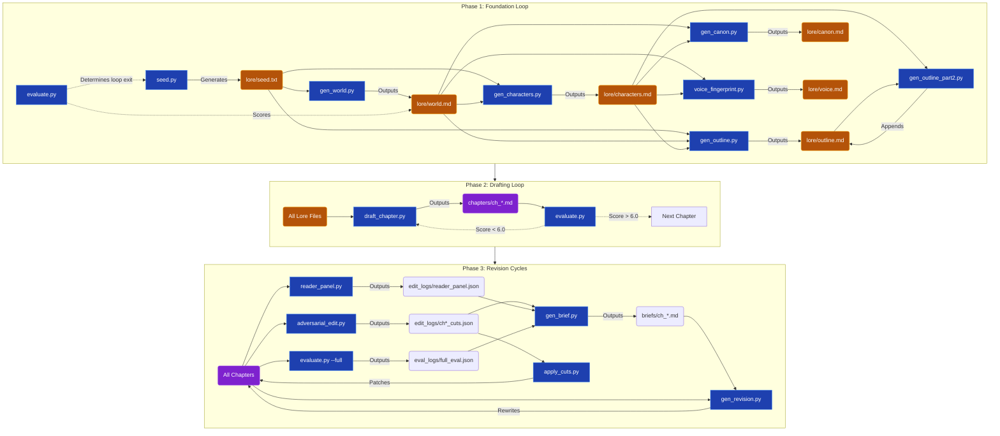

# Autonovel Script Architecture & Data Flow

This document provides a detailed mapping of the autonovel pipeline's scripts, their configurations, their input dependencies, and their output artifacts. It also explains the execution loops that orchestrate them.

---

## 1. Directory Context

- **`scripts/`**: Contains the Python logic and LLM API calls.
- **`config/`**: Contains `.toml` configuration files (prompts, temperature, max_tokens).
- **`lore/`**: The state of the novel (world, characters, outline, voice).
- **`chapters/`**: The raw `.md` prose files.
- **`edit_logs/` & `eval_logs/` & `briefs/`**: Transient data files for the revision cycles.

---

## 2. End-to-End Workflow Diagram

---

## 3. Phase 1: Foundation (Iterative Loop)

**Execution Logic:** Managed by `run_pipeline.py`. It runs the entire sequence below, then calls `evaluate.py`. If the score improves over the previous iteration, it commits the changes. If not, it does a hard reset. This loop repeats until the foundation scores `> 7.5`, ensuring a robust world before drafting begins.

| Script | Configuration File (`config/`) | Inputs | Outputs |
| :--- | :--- | :--- | :--- |
| **`seed.py`** | `seed.toml` | *None* | `seed.txt` |
| **`gen_world.py`** | `gen_world.toml` | `seed.txt` | `lore/world.md` |
| **`gen_characters.py`** | `gen_characters.toml` | `seed.txt`, `lore/world.md` | `lore/characters.md` |
| **`gen_outline.py`** | `gen_outline.toml` | `seed.txt`, `world.md`, `characters.md` | `lore/outline.md` (Beats) |
| **`gen_outline_part2.py`** | `gen_outline_part2.toml` | `outline.md`, `characters.md` | `lore/outline.md` (Foreshadowing) |
| **`gen_canon.py`** | `gen_canon.toml` | `world.md`, `characters.md` | `lore/canon.md` (Hard facts) |
| **`voice_fingerprint.py`** | *Internal prompts (currently)* | `world.md`, `characters.md` | `lore/voice.md` (Prose identity) |

---

## 4. Phase 2: Drafting (Sequential Retry Loop)

**Execution Logic:** Managed by `run_pipeline.py`. It takes the generated outline and drafts chapters sequentially (1 to N). For each chapter, it drafts the prose and immediately calls `evaluate.py`. If the score is `< 6.0`, it discards the text and retries (up to 5 times). Once passing, it commits and moves to the next chapter.

| Script | Configuration File (`config/`) | Inputs | Outputs |
| :--- | :--- | :--- | :--- |
| **`draft_chapter.py`** | `draft_chapter.toml` | All `lore/` files, Previous Chapter | `chapters/ch_[01-N].md` |
| **`evaluate.py`** | `evaluate.toml` | Single chapter prose | Console Score / Exit Code |

---

## 5. Phase 3: Revision (Multi-Cycle Loop)

**Execution Logic:** Managed by `run_pipeline.py`. The pipeline executes 3 to 6 full revision cycles. Each cycle consists of three steps:
1. **Diagnosis:** Run analytical scripts (`adversarial_edit`, `reader_panel`, `evaluate`) to generate JSON feedback.
2. **Briefing:** `gen_brief.py` dynamically synthesizes the JSON feedback into actionable Markdown briefs (`briefs/*.md`).
3. **Execution:** `gen_revision.py` and `apply_cuts.py` execute the changes on the raw prose.
The loop stops if evaluation scores plateau for two consecutive cycles.

| Script | Configuration File (`config/`) | Inputs | Outputs |
| :--- | :--- | :--- | :--- |
| **`build_arc_summary.py`**| `build_arc_summary.toml` | All `chapters/*.md` | `arc_summary.md` |
| **`adversarial_edit.py`** | `adversarial_edit.toml` | All `chapters/*.md` | `edit_logs/ch*_cuts.json` |
| **`reader_panel.py`** | `reader_panel.toml` | `arc_summary.md`, `chapters/*.md` | `edit_logs/reader_panel.json` |
| **`evaluate.py --full`**| `evaluate.toml` | All `chapters/*.md` | `eval_logs/full_eval.json` |
| **`gen_brief.py`** | *No LLM calls (deterministic)*| Cut JSONs, Panel JSONs, Eval JSONs | `briefs/ch_*.md` (Instructions) |
| **`gen_revision.py`** | `gen_revision.toml` | `briefs/ch_*.md`, `chapters/ch_*.md` | Updated `chapters/ch_*.md` |
| **`apply_cuts.py`** | *No LLM calls (deterministic)*| `edit_logs/ch*_cuts.json` | Updated `chapters/ch_*.md` |
| **`build_outline.py`** | `build_outline.toml` | All `chapters/*.md` | Updated `lore/outline.md` |
| **`compare_chapters.py`** | `compare_chapters.toml` | All `chapters/*.md` | `edit_logs/tournament_results.json` |
| **`review.py`** | `review.toml` | All `chapters/*.md` (Final Polish) | `reviews.md` |

---

## 6. Optional / Parallel Modules

These tools operate independently from the main pipeline loop.

| Script | Configuration File (`config/`) | Inputs | Outputs |
| :--- | :--- | :--- | :--- |
| **`gen_art.py`** | `gen_art.toml` | `outline.md`, `world.md`, `voice.md` | `art/visual_style.json` |
| **`gen_art_directions.py`**| `gen_art_directions.toml`| `visual_style.json`, `world.md` | Console / Art Prompts |
